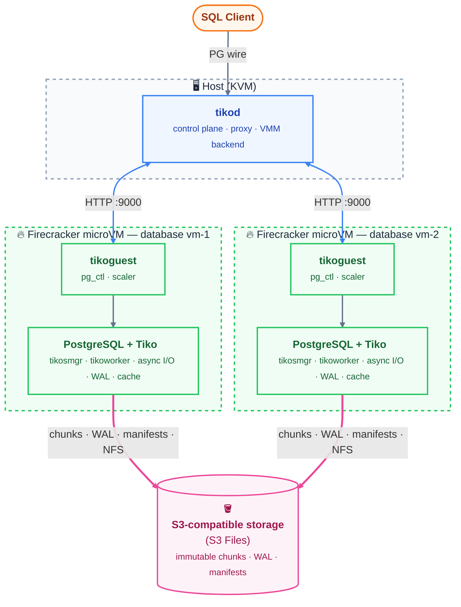

# Tiko

**Serverless Postgres — S3 storage, Firecracker microVM compute.**

Tiko replaces PostgreSQL's magnetic-disk storage manager with an S3-backed block
store. Each database lives in its own microVM, freezes to a snapshot when idle,
and springs back to life on the first client connection. The result: databases
that scale to zero, fork like git branches, and recover to any point in time —
with per-DB cost that falls to near-zero when nobody is connected.

Built in Rust as a set of PostgreSQL extensions + standalone binaries, on top of
a small patch set to vendored PostgreSQL 18.

> [!WARNING]
> **This is a proof-of-concept.** Tiko is an experiment, not production software.
> The code is rough, known to be buggy, and APIs/config will change without notice.
> Expect missing pieces, rough edges, and data-loss scenarios. **Do not use it for
> anything you care about.** That said, ideas, issues, and contributions are welcome.

---

## Why Tiko?

- 🧱 **Compute-storage separation.** Postgres runs in isolated Firecracker
  microVMs; data lives on S3 as immutable chunks — compute can move, restart, or
  scale independently of storage.
- ⚡ **Scales to zero.** Idle VMs warm-pause (TCP survives), then
  snapshot-and-destroy after an idle window. The next connection restores the VM
  in sub-second time.
- 🪣 **Storage is just S3.** A custom `smgr` routes block I/O to chunk-level
  object ops; async reads plug into PostgreSQL 18's AIO subsystem so backends
  never block.
- 🌿 **Copy-on-write (COW) branching.** Every new database is itself a branch of a
  seed database — so provisioning is instant and a fresh DB costs almost nothing.
  Fork any database in one call; branches share immutable chunks, so a fork costs
  only its new blocks.
- ⏪ **Point-in-time recovery.** WAL streams to S3 in near-realtime;
  `tiko_pitr recover` replays to any target time or LSN and promotes
  automatically.

---

## How it works



- **tikosmgr** — the storage manager. Turns block reads/writes into
  chunk-level object operations, transparent to SQL.
- **tikoworker** — the background worker. Owns the async I/O pipeline,
  streams WAL, and runs compaction.
- **tikod** — the control plane. Owns VM lifecycle and proxies client
  traffic, freezing/restoring VMs so idle databases cost nothing.

---

## Repository layout

```
tiko/
├── postgres/     # vendored PostgreSQL 18 (git submodule) + Tiko patches
├── pgsys/        # hand-written PostgreSQL FFI bindings
├── core/         # storage layer: chunks, manifests, store, I/O engine
├── smgr/         # tikosmgr — PostgreSQL storage manager
├── worker/       # tikoworker — background worker (AIO, WAL receiver, compactor)
├── cli/          # operator CLIs: tiko_pitr, tiko_branch, tiko_restore, ...
├── tikod/        # control plane: proxy, node/VMM lifecycle, HTTP API
└── tikoguest/    # in-VM agent: pg control, observability, scaler, freeze
```

```
pgsys ──→ core ──→ smgr (tikosmgr)  ──→ postgres
              └───→ worker (tikoworker) ──→ postgres
                └──→ cli (tiko_pitr, tiko_branch, …)
```

`tikod` and `tikoguest` are standalone binaries that orchestrate Postgres and the
storage layer by spawning CLIs / `pg_ctl` and over HTTP — no internal Rust deps.

---

## Getting started

Clone the repository with submodules.

```bash
git clone --recurse-submodules https://github.com/burmecia/tiko.git
cd tiko
```

Make sure [Rust 1.88+ (edition 2024)](https://rust-lang.org/tools/install/) is installed.

```bash
rustup show
```

### Storage layer (compute-storage separation)

Build Postgres:

```bash
./scripts/build_postgres.sh
```

Run the smoke test:

```bash
./scripts/run_test.sh
```

Other test scripts:

- `./scripts/run_large_data_test.sh` — large data test
- `./scripts/run_pg_test.sh` — PostgreSQL regression test
- `./scripts/run_pitr_test.sh` — PITR test
- `./scripts/run_branch_test.sh` — branching test

### MicroVM orchestration (full stack)

Requires a KVM-enabled Linux host and the `firecracker` binary on `FIRECRACKER_BIN`.
This means EC2 (e.g. `c8i`/`m8i`) or any metal instance with nested virtualization
works out of the box.

**1. Build Firecracker** (Docker required):

```bash
git clone https://github.com/firecracker-microvm/firecracker
cd firecracker && tools/devtool build
export FIRECRACKER_BIN=$(realpath ./build/cargo_target/x86_64-unknown-linux-musl/debug/firecracker)
```

**2. Set up S3 Files** (the object-storage backend). The guest VM mounts an
[S3 Files](https://docs.aws.amazon.com/AmazonS3/latest/userguide/s3-files.html)
file system via NFSv4.2. See `tikod/docs/s3-files-setup.md` for the full runbook,
then copy the creds template:

```bash
cp ./scripts/s3files-creds.env.sample ./tikod/assets/s3files-creds.env
# edit tikod/assets/s3files-creds.env with your AWS credentials
# update S3 Files config in scripts/mount_s3files_vm.sh
```

**3. Prepare the VM image, start tikod, seed a database:**

```bash
./scripts/download_kernel.sh
./scripts/build_initramfs.sh
./scripts/create_rootfs.sh

RUST_LOG=tikod=debug cargo run -p tikod   # start the control plane
```

In another terminal, watch the VM swarm:

```bash
./scripts/vmtop.py
```

In a third terminal, create the seed database:

```bash
curl -X POST localhost:9000/vms/provision
curl -X POST localhost:9000/vms/vm-0/db/init      # takes a couple minutes
curl -X POST localhost:9000/vms/vm-0/db/start

psql -d "host=localhost user=postgres dbname=postgres options='-c tiko.endpoint=vm-0'" \
    -c 'create table tt(a int); insert into tt values(123);'

curl -X PUT localhost:9000/vms/vm-0/branch/backup   # base backup
```

---

## Try it out

### Scale to zero

Spin up 5 databases and watch `vmtop`:

```bash
./scripts/stress_create_dbs.sh 5
```

Each database transitions through:

| Status  | Meaning                                                  |
|---------|----------------------------------------------------------|
| running | normal operation                                         |
| paused  | idle ~2 min — still in memory, TCP connections survive   |
| frozen  | idle ~2 min more — snapshotted and destroyed, zero cost  |

Open a psql connection to any paused/frozen DB and it wakes back to `running`:

```bash
psql -d "host=localhost user=postgres dbname=postgres options='-c tiko.endpoint=vm-2'" \
    -c 'select * from tt'
```

The `tiko.endpoint=vm-N` option selects which database to wake.

### Copy-on-write branching

```bash
# modify vm-2, then back it up
psql -d "...options='-c tiko.endpoint=vm-2'" -c 'insert into tt values(234)'
curl -X PUT localhost:9000/vms/vm-2/branch/backup \
    -d '{"pack":"/mnt/s3files/tiko_root/branch_packs/12/2.tar.zst"}'

# restore into a new VM and start it
curl -X POST localhost:9000/vms/provision -d '{"vm_id":"vm-9"}'
curl -X POST localhost:9000/vms/vm-9/branch/restore \
    -d '{"pack":"/mnt/s3files/tiko_root/branch_packs/12/2.tar.zst","db_id":9,"parent_db_id":2}'
curl -X POST localhost:9000/vms/vm-9/db/start

psql -d "...options='-c tiko.endpoint=vm-9'" -c 'select * from tt'   # data is copied
```

### PITR

```bash
# add data, then list available restore points
psql -d "...options='-c tiko.endpoint=vm-2'" -c 'insert into tt values(999)'
curl -X GET localhost:9000/vms/vm-2/pitr/list

# recover to a chosen timestamp and restart
curl -X POST localhost:9000/vms/vm-2/pitr/recover -d '{"time":"2026-07-11 08:35:00"}'
curl -X POST localhost:9000/vms/vm-2/db/start
psql -d "...options='-c tiko.endpoint=vm-2'" -c 'select * from tt'
```

---

## Roadmap

- [ ] Garbage collector (GC) to recycle unreferenced chunks
- [ ] Bake more services such as PostgREST and Auth into the root filesystem
- [ ] Externalize scheduled jobs such as `pg_cron` into `tikod`
- [ ] Add AWS FSx integration as an optional storage backend
- [ ] Code cleanup and hardening

---

## License

Apache-2.0.
