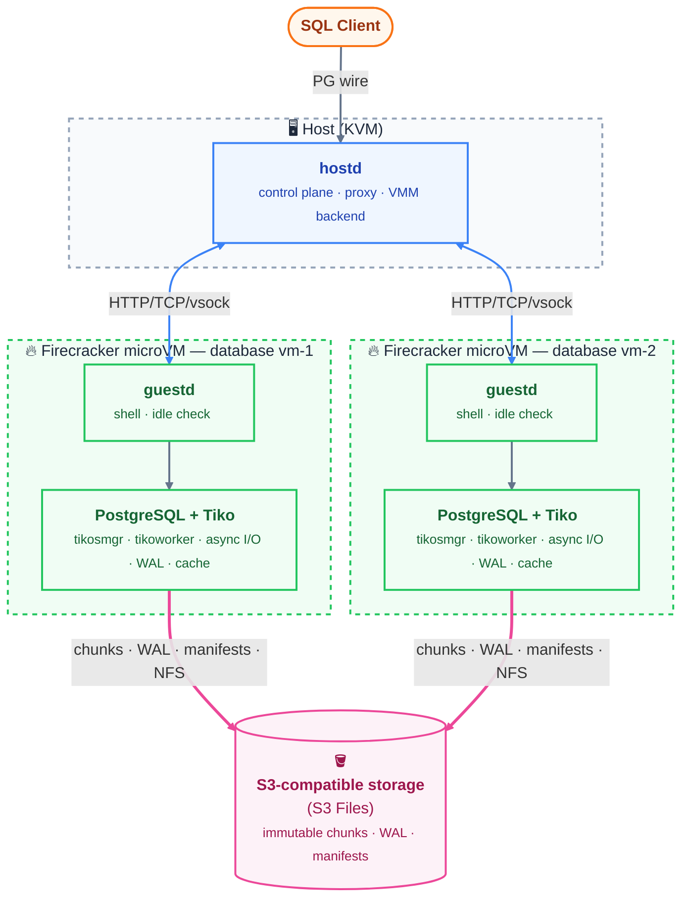

# Tiko - Serverless Postgres

Tiko replaces PostgreSQL's magnetic-disk storage manager with an S3-backed block
store. Running with [Tikovm microVM platform](https://github.com/burmecia/tikovm),
the result is: databases that scale to zero, copy-on-write branching, and recover
to any point in time with per-DB cost that falls to near-zero when nobody is
connected.

Built in Rust as a set of PostgreSQL extensions + standalone binaries, on top of
a small patch set to vendored PostgreSQL 18.

> [!WARNING]
> **This is a proof-of-concept.** The code is rough, known to be buggy, and
> APIs/config will change without notice. Expect missing pieces, rough edges,
> and data-loss scenarios. **Do not use it for anything you care about.**
> That said, ideas, issues, and contributions are welcome.

---

## Why Tiko?

- 🧱 **Compute-storage separation.** Postgres runs in isolated [Firecracker
    microVMs](https://github.com/burmecia/tikovm); data lives on S3 as immutable
    chunks — compute can move, restart, or scale independently of storage.
- ⚡ **Scales to zero.** Idle VMs: snapshot-and-destroy after an idle window.
  The next connection restores the VM in sub-second time.
- 🪣 **Storage is just S3.** A custom `smgr` (Postgres storage manager) routes
  block I/O to chunk-level object ops; async reads plug into PostgreSQL 18's AIO
  subsystem so backends never block.
- 🌿 **Copy-on-write (COW) branching.** Every new database is itself a branch of a
  seed database — so provisioning is instant and a fresh DB costs almost nothing.
  Fork any database in one call; branches share immutable chunks, so a fork costs
  only its new blocks.
- ⏪ **Point-in-time recovery.** WAL streams to S3 in near-realtime;
  `tiko_pitr recover` replays to any target time or LSN and promotes automatically.

---

## How it works


```mermaid
%%{init: {"themeVariables": {"titleColor": "#1e293b", "clusterBkg": "#f8fafc", "clusterBorder": "#94a3b8"}}}%%
flowchart TB
  Client(["<b>SQL Client</b>"])

  subgraph Host ["🖥️ Host (KVM)"]
    direction TB
    hostd["<b>hostd</b><br/><small>control plane · proxy · VMM backend</small>"]
  end

  subgraph VM1 ["🔥 Firecracker microVM — database vm-1"]
    direction TB
    Guest1["<b>guestd</b><br/><small>shell · idle check&nbsp;&nbsp;&nbsp;&nbsp;</small>"]
    PG1["<b>PostgreSQL + Tiko&nbsp;&nbsp;</b><br/><small>tikosmgr · tikoworker · async I/O · WAL · cache</small>"]
    Guest1 --> PG1
  end

  subgraph VM2 ["🔥 Firecracker microVM — database vm-2"]
    direction TB
    Guest2["<b>guestd</b><br/><small>shell · idle check&nbsp;&nbsp;&nbsp;&nbsp;</small>"]
    PG2["<b>PostgreSQL + Tiko&nbsp;&nbsp;</b><br/><small>tikosmgr · tikoworker · async I/O · WAL · cache</small>"]
    Guest2 --> PG2
  end

  S3[("🪣<br/><b>S3-compatible storage</b><br/>(S3 Files)<br/><small>immutable chunks · WAL · manifests</small>")]

  Client -->|PG wire| hostd
  hostd <-->|HTTP/TCP/vsock| Guest1
  hostd <-->|HTTP/TCP/vsock| Guest2
  PG1 ==>|chunks · WAL · manifests · NFS| S3
  PG2 ==>|chunks · WAL · manifests · NFS| S3

  classDef client fill:#fff7ed,stroke:#f97316,stroke-width:2px,color:#9a3412
  classDef control fill:#eff6ff,stroke:#3b82f6,stroke-width:2px,color:#1e40af
  classDef vm fill:#f0fdf4,stroke:#22c55e,stroke-width:2px,color:#166534
  classDef storage fill:#fdf2f8,stroke:#ec4899,stroke-width:2px,color:#9d174d

  class Client client
  class hostd control
  class Guest1,PG1,Guest2,PG2 vm
  class S3 storage

  style Host fill:#f8fafc,stroke:#94a3b8,stroke-width:2px,stroke-dasharray:5 5
  style VM1 fill:#f0fdf4,stroke:#22c55e,stroke-width:2px,stroke-dasharray:5 5
  style VM2 fill:#f0fdf4,stroke:#22c55e,stroke-width:2px,stroke-dasharray:5 5
  style S3 fill:#fdf2f8,stroke:#ec4899,stroke-width:2px
  linkStyle 0 stroke:#64748b,stroke-width:2px
  linkStyle 1 stroke:#64748b,stroke-width:2px
  linkStyle 2 stroke:#64748b,stroke-width:2px
  linkStyle 3 stroke:#3b82f6,stroke-width:2px
  linkStyle 4 stroke:#3b82f6,stroke-width:2px
  linkStyle 5 stroke:#ec4899,stroke-width:3px
  linkStyle 6 stroke:#ec4899,stroke-width:3px
```

- **tikosmgr** — the storage manager. Turns block reads/writes into
  chunk-level object operations, transparent to SQL.
- **tikoworker** — the background worker. Owns the async I/O pipeline,
  streams WAL, and runs compaction.
- **hostd** (tikovm) — the control plane. Owns VM lifecycle and proxies client
  traffic, freezing/restoring VMs so idle databases cost nothing.
- **guestd** (tikovm) — the guest agent. Runs inside each database VM,
  starts/stops Postgres and reports idleness so `hostd` knows when to
  freeze the VM.

---

## Repository layout

```
tiko/
├── postgres/     # vendored PostgreSQL 18 (git submodule) + Tiko patches
├── pgsys/        # hand-written PostgreSQL FFI bindings
├── core/         # storage layer: chunks, manifests, store, I/O engine
├── smgr/         # tikosmgr — PostgreSQL storage manager
├── worker/       # tikoworker — background worker (AIO, WAL receiver, compactor)
├── cli/          # operator CLIs: tiko_pitr, tiko_branch, tiko_restore, ...
```

```
pgsys ──→ core ──→ smgr (tikosmgr)  ──→ postgres
              └───→ worker (tikoworker) ──→ postgres
                └──→ cli (tiko_pitr, tiko_branch, …)
```

---

## Getting started

Clone this repository with submodules and make sure [Rust 1.88+ (edition 2024)](https://rust-lang.org/tools/install/) is installed.

```bash
git clone --recurse-submodules https://github.com/burmecia/tiko.git
cd tiko
rustup show
```

### Storage layer (compute-storage separation)

Build Postgres:

```bash
./scripts/build_postgres.sh
```

Run the smoke test:

```bash
./scripts/test/run_smoke_test.sh
```

Run the large-data test to see compute-storage separation in action:

```bash
./scripts/test/run_large_data_test.sh

# After the run, three directories appear under the repo root:
# - `tt/`         — the Postgres PGDATA directory (compute)
# - `tiko_root/`  — simulated S3-compatible remote storage (storage)
# - `tiko_local/` — local cache, base manifest, and other per-DB state
```

Other test scripts:

- `./scripts/test/run_pg_test.sh` — PostgreSQL regression test
- `./scripts/test/run_pitr_test.sh` — PITR test
- `./scripts/test/run_branch_test.sh` — branching test

### Compute layer (Firecracker microVM)

The compute layer — running Postgres inside Firecracker microVMs, with
snapshot-and-restore for scale-to-zero — lives in a separate project:
**[tikovm](https://github.com/burmecia/tikovm)**.

tikovm supplies the VMs Tiko runs in: its `hostd` daemon manages the VM
lifecycle (create, snapshot, restore, destroy) on a KVM host and proxies
client connections into the right VM, so an idle database is frozen and
wakes on the first connection. Tiko itself is the storage engine running
inside those VMs — see the tikovm repository for setup and usage.

---

## Roadmap

- [ ] Garbage collector (GC) to recycle unreferenced chunks
- [ ] Code cleanup and hardening

---

## License

AGPL-3.0-only.
